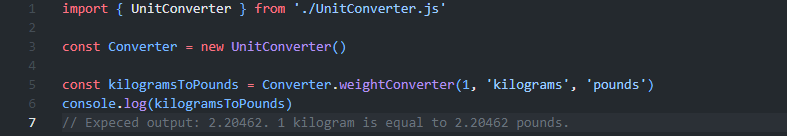

## Unit Converter Module

How to add to your project:
    This entire module is based in a single file for maximum ease to install. Just add the UnitConverter.js file to your project and import it wherever you please.

## Overview:
    The Unit Converter Module allows conversion between various units in categories such as length, weight, temperature, volume, and time. This module is designed to be simple to use, modular, and flexible for various applications where unit conversions are needed.

## Features:
    Convert between multiple units for different categories. time, temp, weight, length and volume
    Easy to extend by adding new categories or units.
    Modular design with separate conversion logic for each category.
    Clear error handling for invalid unit conversions.

## All supported units can be converted interchangeably within their respective categories.

## Supported time conversion types:
    minutes
    hours
    days
    seconds
    milliseconds
    microseconds
    nanoseconds
    picoseconds

## Supported temperature conversion types:
    celsius
    fahrenheit
    kelvin

## Supported weight conversion types:
    grams
    kilograms
    pounds
    ounces
    stones

## Supported length conversion types:
    meters
    kilometers
    inches
    feet
    yards
    miles

## Supported volume conversion types:
    liters
    milliliters
    gallons
    quarts
    pints
    cups

## Converting arrays is also supported using the same methods.

## Example use of module:

## Explanation:
    Every converter method takes in 3 different parameters.
    The first one is the amount of units to convert. Or an array with an amount of units.
    The second one is the unit to convert from.
    The third on is the unit to convert to.
    In this example we are using the weightConverter to convert 1 kilogram to pounds.

## Notes:
    Feel free to contribute to this project by adding more unit types to convert.
    Any bug reports can be sent to <jakob.rejdemyhr@gmail.com>